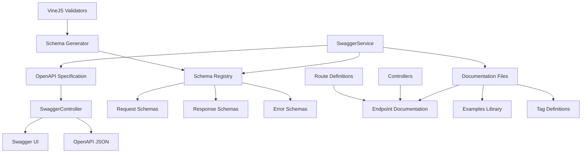

# Design Document

## Overview

This design outlines a comprehensive update to the Web2Img API's OpenAPI/Swagger documentation system. The current implementation has basic coverage for core screenshot endpoints but lacks comprehensive documentation for all available APIs, complete schema definitions, and proper organization. This update will create a complete, maintainable, and developer-friendly documentation system that accurately reflects all API capabilities.

The design focuses on extending the existing swagger-jsdoc and swagger-ui-express implementation while maintaining the current architecture and adding comprehensive coverage for all endpoints.

## Architecture

### Current Architecture Analysis

The existing documentation system uses:
- **swagger-jsdoc**: For generating OpenAPI specs from JSDoc comments
- **swagger-ui-express**: For serving the interactive documentation UI
- **SwaggerService**: Centralized service for managing OpenAPI specification
- **SwaggerController**: HTTP controller for serving documentation endpoints
- **Inline JSDoc annotations**: Documentation embedded in controller files

### Enhanced Architecture Design

The updated system will maintain the current architecture while adding:

1. **Comprehensive Schema Registry**: Centralized schema definitions for all data models
2. **Modular Documentation Structure**: Organized documentation files by feature area
3. **Enhanced Validation Integration**: Direct mapping between VineJS validators and OpenAPI schemas
4. **Automated Schema Generation**: Tools to generate schemas from existing validators
5. **Documentation Validation**: Automated checks to ensure documentation accuracy

### Component Relationships



## Components and Interfaces

### 1. Enhanced SwaggerService

**Purpose**: Central service for managing OpenAPI specification with enhanced schema management

**Key Enhancements**:
- Dynamic schema generation from VineJS validators
- Modular documentation loading
- Schema validation and consistency checking
- Environment-aware server configuration

**Interface**:
```typescript
interface EnhancedSwaggerService {
  initialize(): void
  getSpec(): OpenAPIV3.Document
  generateSchemaFromValidator(validator: any): OpenAPIV3.SchemaObject
  validateDocumentation(): ValidationResult[]
  getSchemaRegistry(): SchemaRegistry
  updateServerUrls(baseUrl: string): void
}
```

### 2. Schema Registry

**Purpose**: Centralized repository for all OpenAPI schema definitions

**Structure**:
```typescript
interface SchemaRegistry {
  requests: Record<string, OpenAPIV3.SchemaObject>
  responses: Record<string, OpenAPIV3.SchemaObject>
  errors: Record<string, OpenAPIV3.SchemaObject>
  components: Record<string, OpenAPIV3.SchemaObject>
}
```

**Key Schemas to Define**:
- Screenshot request/response models
- Batch processing models
- Health check models
- Dashboard API models
- Authentication models
- Error response models

### 3. Documentation File Structure

**Organized by Feature Areas**:
```
docs/swagger/
├── core/
│   ├── info.ts          # API info and general documentation
│   ├── security.ts      # Authentication and security schemes
│   └── servers.ts       # Server configurations
├── schemas/
│   ├── requests.ts      # All request schemas
│   ├── responses.ts     # All response schemas
│   ├── errors.ts        # Error response schemas
│   └── components.ts    # Reusable component schemas
├── endpoints/
│   ├── screenshots.ts   # Screenshot endpoint documentation
│   ├── batch.ts         # Batch processing documentation
│   ├── health.ts        # Health and monitoring documentation
│   ├── dashboard.ts     # Dashboard API documentation
│   └── cache.ts         # Cache management documentation
├── examples/
│   ├── requests.ts      # Request examples
│   ├── responses.ts     # Response examples
│   └── workflows.ts     # Multi-step workflow examples
└── tags/
    └── definitions.ts   # Tag definitions and descriptions
```

### 4. Schema Generation Utilities

**Purpose**: Automated tools to generate OpenAPI schemas from existing VineJS validators

**Key Functions**:
```typescript
interface SchemaGenerator {
  generateFromVineValidator(validator: VineValidator): OpenAPIV3.SchemaObject
  generateRequestSchema(controllerMethod: string): OpenAPIV3.SchemaObject
  generateResponseSchema(responseType: string): OpenAPIV3.SchemaObject
  validateSchemaConsistency(): ValidationResult[]
}
```

### 5. Enhanced Controller Documentation

**Standardized JSDoc Format**:
```typescript
/**
 * @swagger
 * /endpoint:
 *   method:
 *     summary: Brief description
 *     description: Detailed description with usage notes
 *     tags: [TagName]
 *     security: [{ ApiKeyAuth: [] }]
 *     parameters: [...]
 *     requestBody: {...}
 *     responses: {...}
 *     examples: {...}
 */
```

## Data Models

### Core Schema Definitions

#### 1. Screenshot Request Schema
```typescript
ScreenshotRequest: {
  type: 'object',
  required: ['url'],
  properties: {
    url: { type: 'string', format: 'uri', description: 'Website URL to screenshot' },
    format: { type: 'string', enum: ['png', 'jpeg', 'webp'], default: 'png' },
    width: { type: 'integer', minimum: 1, maximum: 5000, default: 1280 },
    height: { type: 'integer', minimum: 1, maximum: 5000, default: 720 },
    timeout: { type: 'integer', minimum: 5000, maximum: 60000, default: 30000 },
    fullPage: { type: 'boolean', default: false },
    cache: { type: 'boolean', default: true }
  }
}
```

#### 2. Batch Request Schema
```typescript
BatchRequest: {
  type: 'object',
  required: ['items'],
  properties: {
    items: {
      type: 'array',
      minItems: 1,
      maxItems: 200,
      items: { $ref: '#/components/schemas/BatchItem' }
    },
    config: { $ref: '#/components/schemas/BatchConfig' }
  }
}
```

#### 3. Health Response Schema
```typescript
HealthResponse: {
  type: 'object',
  required: ['status', 'timestamp'],
  properties: {
    status: { type: 'string', enum: ['healthy', 'unhealthy', 'degraded'] },
    timestamp: { type: 'string', format: 'date-time' },
    uptime: { type: 'number', description: 'Uptime in seconds' },
    components: { $ref: '#/components/schemas/ComponentHealth' }
  }
}
```

### Schema Mapping Strategy

**VineJS to OpenAPI Mapping**:
- `vine.string()` → `{ type: 'string' }`
- `vine.string().url()` → `{ type: 'string', format: 'uri' }`
- `vine.number().min(x).max(y)` → `{ type: 'number', minimum: x, maximum: y }`
- `vine.enum([...])` → `{ type: 'string', enum: [...] }`
- `vine.boolean()` → `{ type: 'boolean' }`
- `vine.array(schema)` → `{ type: 'array', items: schema }`
- `vine.object({...})` → `{ type: 'object', properties: {...} }`

## Error Handling

### Comprehensive Error Documentation

#### 1. Standard Error Response Format
```typescript
ErrorResponse: {
  type: 'object',
  required: ['detail'],
  properties: {
    detail: {
      type: 'object',
      required: ['error', 'message'],
      properties: {
        error: { type: 'string', description: 'Error code' },
        message: { type: 'string', description: 'Human-readable error message' },
        field: { type: 'string', description: 'Field name for validation errors' },
        code: { type: 'string', description: 'Specific error code' }
      }
    }
  }
}
```

#### 2. Error Categories
- **Validation Errors** (400): Invalid request parameters
- **Authentication Errors** (401): Invalid or missing API key
- **Authorization Errors** (403): Insufficient permissions
- **Not Found Errors** (404): Resource not found
- **Rate Limit Errors** (429): Rate limit exceeded
- **Server Errors** (500): Internal server errors
- **Service Unavailable** (503): System maintenance or overload

#### 3. Error Response Examples
```typescript
ValidationErrorExample: {
  detail: {
    error: 'VALIDATION_ERROR',
    message: 'Invalid URL format provided',
    field: 'url'
  }
}

RateLimitErrorExample: {
  detail: {
    error: 'RATE_LIMITED',
    message: 'Rate limit exceeded. You can make 100 requests per hour. Try again in 45 minutes.'
  }
}
```

## Testing Strategy

### Documentation Testing Approach

#### 1. Schema Validation Tests
- Validate all OpenAPI schemas against OpenAPI 3.0 specification
- Test schema consistency with actual API responses
- Verify example data matches schema definitions

#### 2. Documentation Completeness Tests
- Ensure all public endpoints have documentation
- Verify all request/response models are documented
- Check that all error codes are documented

#### 3. Interactive Testing
- Automated tests using Swagger UI interface
- Validate that all examples work correctly
- Test authentication flows through documentation

#### 4. Integration Tests
```typescript
describe('OpenAPI Documentation', () => {
  test('should generate valid OpenAPI specification', () => {
    const spec = swaggerService.getSpec()
    expect(spec).toMatchOpenAPISchema()
  })

  test('should document all public endpoints', () => {
    const routes = getAllPublicRoutes()
    const documentedPaths = Object.keys(spec.paths)
    expect(documentedPaths).toContainAllRoutes(routes)
  })

  test('should have working examples', async () => {
    for (const example of getAllExamples()) {
      const response = await testApiCall(example)
      expect(response).toMatchSchema(example.schema)
    }
  })
})
```

### Performance Testing
- Documentation loading time optimization
- Swagger UI rendering performance
- OpenAPI JSON generation performance
- Memory usage monitoring for large specifications

## Implementation Phases

### Phase 1: Foundation Enhancement
1. Enhance SwaggerService with schema registry
2. Create modular documentation file structure
3. Implement schema generation utilities
4. Update existing screenshot endpoint documentation

### Phase 2: Comprehensive Coverage
1. Document all health and monitoring endpoints
2. Add complete batch processing documentation
3. Document dashboard API endpoints
4. Add cache management endpoint documentation

### Phase 3: Advanced Features
1. Implement automated schema generation from validators
2. Add comprehensive examples library
3. Create workflow documentation
4. Implement documentation validation tools

### Phase 4: Quality and Optimization
1. Add comprehensive testing suite
2. Optimize performance and loading times
3. Enhance UI/UX of documentation interface
4. Add advanced features like code generation support

This design provides a comprehensive foundation for creating complete, accurate, and maintainable OpenAPI documentation that will significantly improve the developer experience for the Web2Img API.