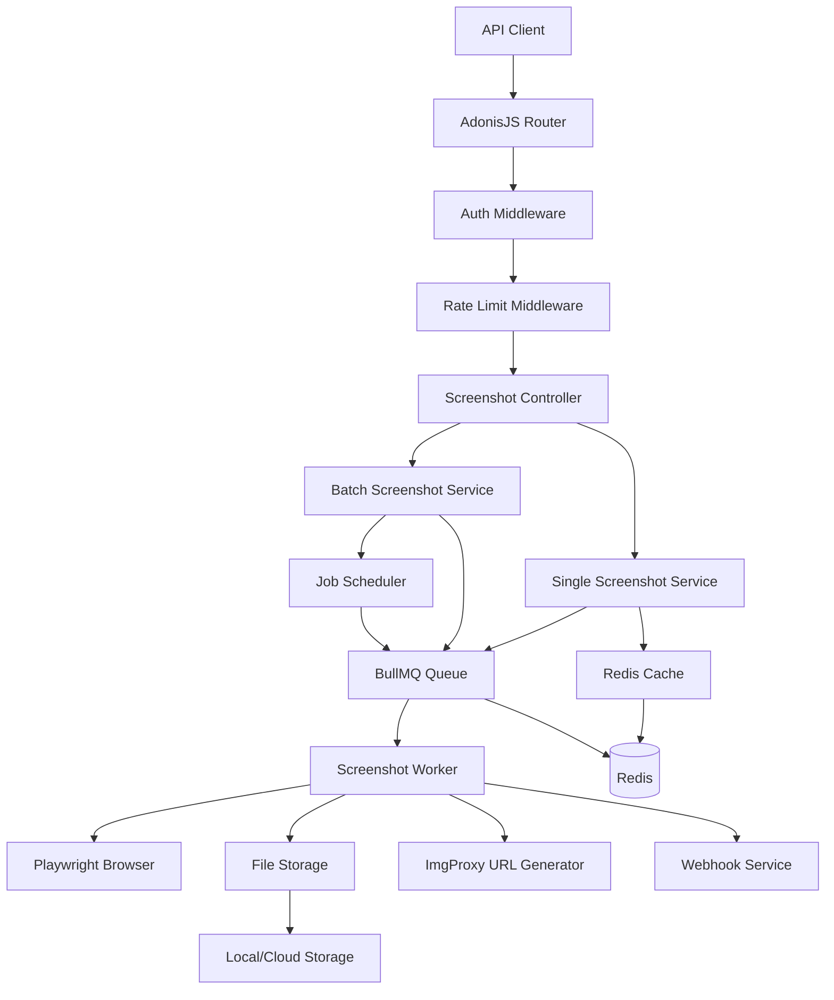

# Design Document

## Overview

The Website Screenshot API is a comprehensive screenshot service built on AdonisJS that provides both single and batch screenshot capabilities. The system leverages Playwright for browser automation, BullMQ for job queue management, Redis for caching and queue storage, and integrates with imgproxy for optimized image delivery. The architecture supports high-throughput screenshot generation with intelligent caching, rate limiting, webhook notifications, and scheduled/recurring batch jobs.

## Architecture

### High-Level Architecture



### Technology Stack

- **Framework**: AdonisJS v6 with TypeScript
- **Browser Automation**: Playwright (Chromium engine)
- **Job Queue**: BullMQ with Redis
- **Caching**: Redis
- **Image Processing**: ImgProxy integration
- **Storage**: Local filesystem (extensible to cloud storage)
- **Database**: MySQL (for API keys, job metadata)
- **Authentication**: API key-based authentication

## Components and Interfaces

### 1. API Layer

#### Screenshot Controller
```typescript
interface ScreenshotController {
  // Single screenshot endpoint
  single(request: HttpContext['request'], response: HttpContext['response']): Promise<void>
  
  // Batch screenshot endpoints
  createBatch(request: HttpContext['request'], response: HttpContext['response']): Promise<void>
  getBatchStatus(request: HttpContext['request'], response: HttpContext['response']): Promise<void>
}
```

#### Request/Response Models
```typescript
interface SingleScreenshotRequest {
  url: string
  format?: 'png' | 'jpeg' | 'webp'
  width?: number // 1-5000
  height?: number // 1-5000
}

interface SingleScreenshotResponse {
  url: string // ImgProxy URL
  cached?: boolean
}

interface BatchScreenshotRequest {
  items: BatchItem[]
  config?: BatchConfig
}

interface BatchItem {
  id: string
  url: string
  format?: 'png' | 'jpeg' | 'webp'
  width?: number
  height?: number
}

interface BatchConfig {
  parallel?: number // 1-50, default 3
  timeout?: number // 5-60 seconds, default 30
  webhook?: string
  webhook_auth?: string
  fail_fast?: boolean
  cache?: boolean
  priority?: 'high' | 'normal' | 'low'
  scheduled_time?: string // ISO 8601
  recurrence?: 'hourly' | 'daily' | 'weekly' | 'monthly' | 'custom'
  recurrence_interval?: number
  recurrence_count?: number
  recurrence_cron?: string
  rate_limit?: number
}

interface BatchResponse {
  job_id: string
  status: 'pending' | 'processing' | 'completed' | 'failed' | 'scheduled'
  total: number
  completed: number
  failed: number
  created_at: string
  updated_at: string
  scheduled_time?: string
  next_scheduled_time?: string
  estimated_completion?: string
}
```

### 2. Service Layer

#### Screenshot Service
```typescript
interface ScreenshotService {
  // Single screenshot processing
  captureScreenshot(params: ScreenshotParams): Promise<ScreenshotResult>
  
  // Batch processing
  createBatchJob(request: BatchScreenshotRequest): Promise<BatchJob>
  getBatchJobStatus(jobId: string): Promise<BatchJobStatus>
  
  // URL transformation
  transformUrl(originalUrl: string): string
  
  // Cache management
  getCachedScreenshot(cacheKey: string): Promise<string | null>
  setCachedScreenshot(cacheKey: string, imageUrl: string, ttl: number): Promise<void>
}

interface ScreenshotParams {
  url: string
  format: 'png' | 'jpeg' | 'webp'
  width: number
  height: number
  timeout: number
  useCache: boolean
}

interface ScreenshotResult {
  imageUrl: string
  cached: boolean
  processingTime?: number
}
```

#### Queue Service
```typescript
interface QueueService {
  // Job management
  addScreenshotJob(params: ScreenshotJobData): Promise<Job>
  addBatchJob(batchData: BatchJobData): Promise<Job>
  
  // Scheduling
  scheduleJob(jobData: any, scheduledTime: Date): Promise<Job>
  createRecurringJob(jobData: any, recurrence: RecurrenceConfig): Promise<Job>
  
  // Status and monitoring
  getJobStatus(jobId: string): Promise<JobStatus>
  getQueueMetrics(): Promise<QueueMetrics>
}

interface ScreenshotJobData {
  url: string
  format: string
  width: number
  height: number
  timeout: number
  cacheKey: string
  batchId?: string
  itemId?: string
}

interface BatchJobData {
  items: BatchItem[]
  config: BatchConfig
  webhook?: WebhookConfig
}
```

### 3. Worker Layer

#### Screenshot Worker
```typescript
interface ScreenshotWorker {
  // Main processing function
  process(job: Job<ScreenshotJobData>): Promise<ScreenshotResult>
  
  // Browser management
  initializeBrowser(): Promise<Browser>
  createPage(browser: Browser, options: PageOptions): Promise<Page>
  
  // Screenshot capture
  captureScreenshot(page: Page, options: ScreenshotOptions): Promise<Buffer>
  
  // Storage and URL generation
  saveScreenshot(buffer: Buffer, filename: string): Promise<string>
  generateImgProxyUrl(imagePath: string, options: ImageOptions): string
}

interface PageOptions {
  width: number
  height: number
  timeout: number
}

interface ScreenshotOptions {
  format: 'png' | 'jpeg' | 'webp'
  quality?: number
}
```

### 4. Storage and Cache Layer

#### Storage Service
```typescript
interface StorageService {
  // File operations
  saveFile(buffer: Buffer, path: string): Promise<string>
  getFileUrl(path: string): string
  deleteFile(path: string): Promise<void>
  
  // Cleanup
  cleanupOldFiles(olderThan: Date): Promise<number>
}
```

#### Cache Service
```typescript
interface CacheService {
  // Basic cache operations
  get(key: string): Promise<string | null>
  set(key: string, value: string, ttl: number): Promise<void>
  del(key: string): Promise<void>
  
  // Cache key generation
  generateCacheKey(url: string, options: ScreenshotOptions): string
  
  // Cache management
  clearExpired(): Promise<number>
  getStats(): Promise<CacheStats>
}
```

### 5. Integration Layer

#### ImgProxy Service
```typescript
interface ImgProxyService {
  // URL generation
  generateUrl(imagePath: string, options: ImgProxyOptions): string
  
  // Configuration
  isConfigured(): boolean
  validateConfig(): boolean
}

interface ImgProxyOptions {
  width?: number
  height?: number
  format?: string
  quality?: number
  resize?: 'fit' | 'fill' | 'crop'
}
```

#### Webhook Service
```typescript
interface WebhookService {
  // Webhook delivery
  sendWebhook(url: string, payload: any, auth?: string): Promise<void>
  
  // Retry logic
  retryWebhook(webhookData: WebhookData, attempt: number): Promise<void>
  
  // Validation
  validateWebhookUrl(url: string): boolean
}

interface WebhookData {
  url: string
  payload: any
  auth?: string
  maxRetries: number
}
```

## Data Models

### Database Models

#### API Key Model
```typescript
interface ApiKey {
  id: string
  key: string
  name: string
  userId: number
  rateLimit: number
  isActive: boolean
  createdAt: DateTime
  updatedAt: DateTime
}
```

#### Batch Job Model
```typescript
interface BatchJob {
  id: string
  status: BatchJobStatus
  totalItems: number
  completedItems: number
  failedItems: number
  config: BatchConfig
  results: BatchResult[]
  createdAt: DateTime
  updatedAt: DateTime
  scheduledAt?: DateTime
  completedAt?: DateTime
}

interface BatchResult {
  itemId: string
  status: 'success' | 'error' | 'pending' | 'processing'
  url?: string
  error?: string
  cached?: boolean
}
```

### Redis Data Structures

#### Cache Keys
```
screenshot:cache:{hash} -> imgproxy_url
screenshot:lock:{url} -> processing_timestamp
rate_limit:{api_key}:{window} -> request_count
```

#### Queue Data
```
bullmq:screenshot:waiting -> [job_ids]
bullmq:screenshot:active -> {job_id: worker_id}
bullmq:screenshot:completed -> [job_results]
bullmq:screenshot:failed -> [job_errors]
```

## Error Handling

### Error Types and Responses

```typescript
enum ErrorCode {
  INVALID_URL = 'invalid_url',
  SCREENSHOT_FAILED = 'screenshot_failed',
  TIMEOUT = 'timeout',
  RATE_LIMITED = 'rate_limited',
  SERVICE_OVERLOADED = 'service_overloaded',
  STORAGE_ERROR = 'storage_error',
  WEBHOOK_FAILED = 'webhook_failed',
  BATCH_TOO_LARGE = 'batch_too_large',
  INVALID_FORMAT = 'invalid_format',
  INVALID_DIMENSIONS = 'invalid_dimensions'
}

interface ErrorResponse {
  detail: {
    error: ErrorCode
    message: string
    retry_after?: number
  }
}
```

### Error Handling Strategy

1. **Input Validation**: Validate all inputs at the controller level
2. **Graceful Degradation**: Return cached results when possible during failures
3. **Circuit Breaker**: Implement circuit breaker pattern for external services
4. **Retry Logic**: Exponential backoff for transient failures
5. **Monitoring**: Log all errors with appropriate context

## Testing Strategy

### Unit Testing
- Service layer methods
- URL transformation logic
- Cache key generation
- ImgProxy URL generation
- Webhook payload formatting

### Integration Testing
- API endpoints with authentication
- Queue job processing
- Database operations
- Redis cache operations
- File storage operations

### End-to-End Testing
- Complete screenshot workflow
- Batch job processing
- Webhook delivery
- Scheduled job execution
- Rate limiting behavior

### Performance Testing
- Load testing with concurrent requests
- Memory usage during batch processing
- Queue throughput measurement
- Cache hit rate optimization

### Test Data Management
- Mock Playwright browser for unit tests
- Test image fixtures
- Sample webhook endpoints
- Rate limiting test scenarios

## Security Considerations

### Authentication and Authorization
- API key validation middleware
- Rate limiting per API key
- Request size limits
- URL validation and sanitization

### Input Validation
- URL format validation
- Dimension range validation
- File size limits
- Webhook URL validation

### Resource Protection
- Memory limits for browser instances
- Disk space monitoring
- CPU usage limits
- Network timeout controls

### Data Privacy
- No persistent storage of screenshot content
- Secure webhook delivery
- API key encryption
- Audit logging

## Performance Optimization

### Caching Strategy
- Redis-based result caching
- Cache key optimization
- TTL management
- Cache warming for popular URLs

### Queue Optimization
- Batch processing for efficiency
- Priority queues for urgent requests
- Dead letter queue handling
- Worker scaling based on load

### Browser Management
- Browser instance pooling
- Page reuse optimization
- Memory cleanup
- Headless mode optimization

### Storage Optimization
- Temporary file cleanup
- Compression for storage
- CDN integration via ImgProxy
- Lazy loading for large batches

## Monitoring and Observability

### Metrics Collection
- Request rate and response times
- Queue depth and processing times
- Cache hit rates
- Error rates by type
- Resource utilization

### Logging Strategy
- Structured logging with correlation IDs
- Request/response logging
- Error logging with stack traces
- Performance metrics logging

### Health Checks
- API endpoint health
- Redis connectivity
- Queue worker status
- Browser instance health
- Storage availability

### Alerting
- High error rates
- Queue backup
- Memory/CPU thresholds
- Storage space warnings
- Webhook delivery failures